<p align="center">
  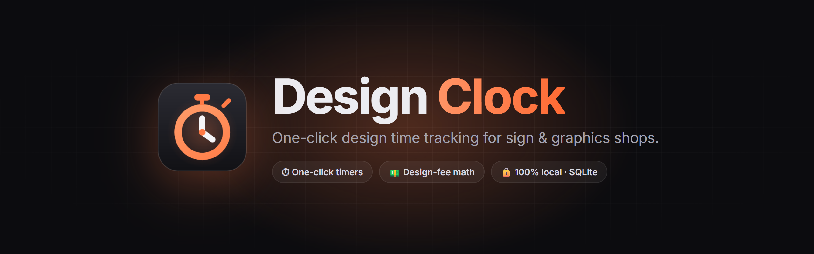
</p>

<p align="center">
  <b>Know exactly how much design time every job takes, so you can quote it.</b><br/>
  A fast, local-first desktop time tracker built for graphic designers at sign &amp; print shops.
</p>

<p align="center">
  <a href="#-quick-start"><strong>Quick start</strong></a> ·
  <a href="#-features"><strong>Features</strong></a> ·
  <a href="#-screenshots"><strong>Screenshots</strong></a> ·
  <a href="#%EF%B8%8F-keyboard-shortcuts"><strong>Shortcuts</strong></a> ·
  <a href="#-how-it-works"><strong>How it works</strong></a> ·
  <a href="#-faq"><strong>FAQ</strong></a>
</p>

<p align="center">
  
  
  
  
  
  
  <a href="LICENSE"></a>
</p>

<br/>

<p align="center">
  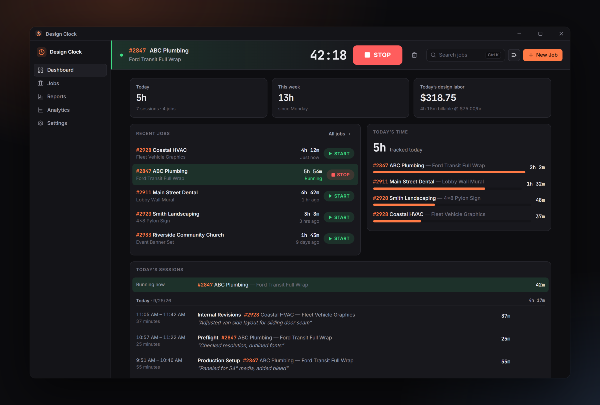
</p>

---

## 💡 Why Design Clock?

Design labor is the hardest part of a sign quote to price. A vehicle wrap might take two hours of design, or eight once revisions start. Most shops guess.

Design Clock makes tracking that time **effortless enough to actually do** while you jump between 5–15 jobs a day:

| | The usual way | With Design Clock |
|---|---|---|
| **Starting** | Fill out a form, pick a task, then start | **One click** on a recent job, or press `Space` |
| **Switching jobs** | Stop, save, find the next job, start | Click **START** on the next job and press `Enter` |
| **Labeling** | Decide what you'll do *before* you do it | Label **after** you stop: press a number key, then `Enter` |
| **Quoting** | "It feels like about 3 hours?" | *"Wraps average **3h 46m** of design; revisions add **35m** each."* |
| **Your data** | Someone else's cloud and subscription | A single SQLite file **on your computer** |

---

## ✨ Features

<table>
<tr>
<td width="33%" valign="top">

### ⏱️ One-click timers
Start any recent job with one click. The running timer is always pinned to the top of the window: job #, client, project and elapsed time, with big START / STOP buttons.

</td>
<td width="33%" valign="top">

### 🏷️ Label *after* you work
Stop the timer and a small **"What did you work on?"** prompt appears. It remembers the last category you used on that job, so most of the time you just press `Enter`.

</td>
<td width="33%" valign="top">

### 🔀 Fast job switching
Only one timer runs at a time. Starting another job asks *"Stop the current timer and start this job?"*. Press `Enter`, then label the old session while the new one is already running.

</td>
</tr>
<tr>
<td valign="top">

### 💵 Design-fee calculator
Set your hourly design rate and currency. Every job shows **tracked time**, **billable time** and **estimated design labor**, with optional rounding (nearest / round up to 15 or 30 minutes).

</td>
<td valign="top">

### 📊 Reports
Filter by date range, job, client, category and job status. Group by job, client, category, day, week or month. See total hours, billable hours, estimated revenue and average time per job.

</td>
<td valign="top">

### 📈 Quoting analytics
See how long each kind of work *really* takes: average Initial Design per job, average revision session, average total design time per completed job, and weekly hours.

</td>
</tr>
<tr>
<td valign="top">

### 🔎 Instant search
`Ctrl+K`, type `2847`, and you're looking at job #2847. Search by job number, client or project. `Ctrl+Enter` starts the timer straight from the results.

</td>
<td valign="top">

### 🛟 Crash-proof timers
Timers are saved as timestamps in the database the moment you click START. If you close the window, the app crashes or Windows reboots, the timer is still running when you come back.

</td>
<td valign="top">

### 🔒 Local-first &amp; private
No account, login, subscription or cloud. Everything lives in one SQLite file on your PC. Export to CSV or back up the database any time.

</td>
</tr>
</table>

<details>
<summary><b>…and the rest of the details</b></summary>
<br/>

- **Jobs** with job number, client, project, notes, created date and status: *Active · On Hold · Completed · Archived*.
- **14 default session categories** (Initial Design, Design Concepts, Revisions, Client Revisions, Internal Revisions, Mockup, Photo Mockup, Logo Recreation, Vector Cleanup, Preflight, Production Setup, File Preparation, Research, Other). Add, rename, reorder, hide or delete your own.
- **Manual time entry** for when you forgot the timer: start and end time, or just a duration.
- **Edit or delete any session.** Double-click it. Deletes can be undone from the notification.
- **Optional idle detection** (off by default): *"You appear to have been inactive for 18 minutes. Keep or remove idle time?"* It only checks how long since your last keyboard or mouse input. No screenshots, keystroke logging or mouse tracking.
- **Raw time is never altered.** Billable time is always calculated from the original records.
- **CSV export** (with every field needed for quoting), a **full SQLite backup** and a **JSON export**.
- **Dark and light themes**, compact professional layout, and a keyboard-first workflow.
- Elapsed time in the **taskbar title**, so you can see the timer from Illustrator or Photoshop.

</details>

---

## 📸 Screenshots

<table>
<tr>
<td width="50%" align="center">
  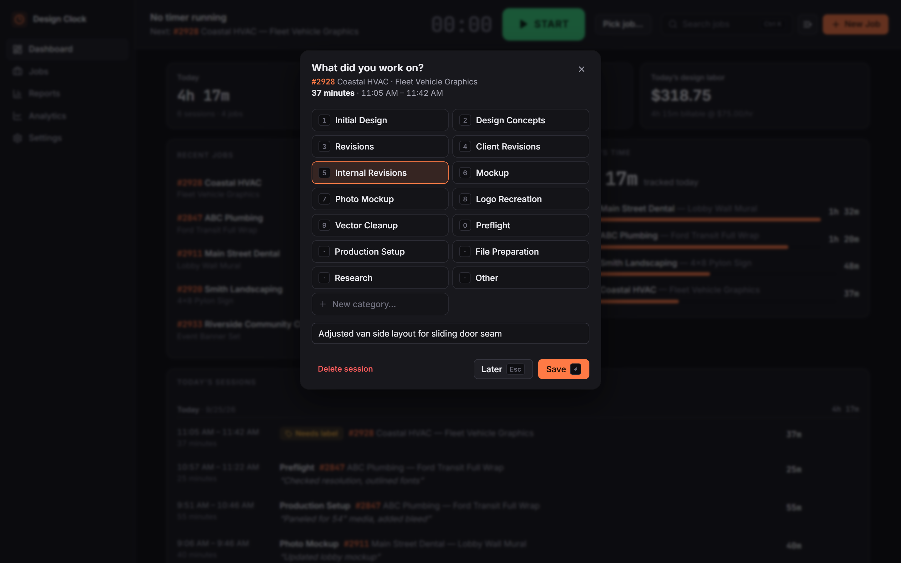<br/>
  <sub><b>Label after you stop</b>: number keys pick a category, <code>Enter</code> saves</sub>
</td>
<td width="50%" align="center">
  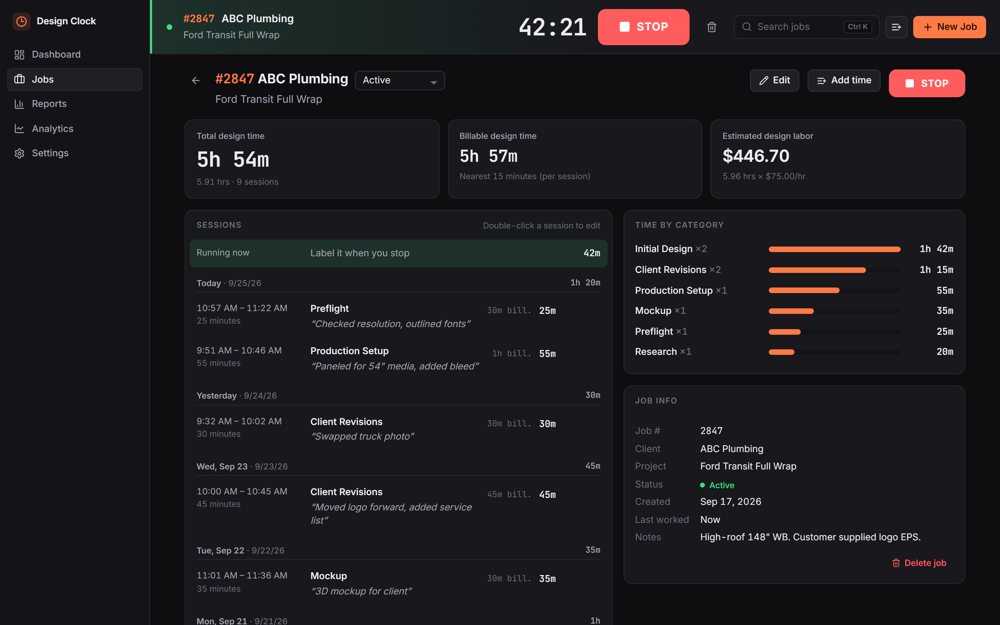<br/>
  <sub><b>Job detail</b>: total design time, billable time, labor estimate and category breakdown</sub>
</td>
</tr>
<tr>
<td align="center">
  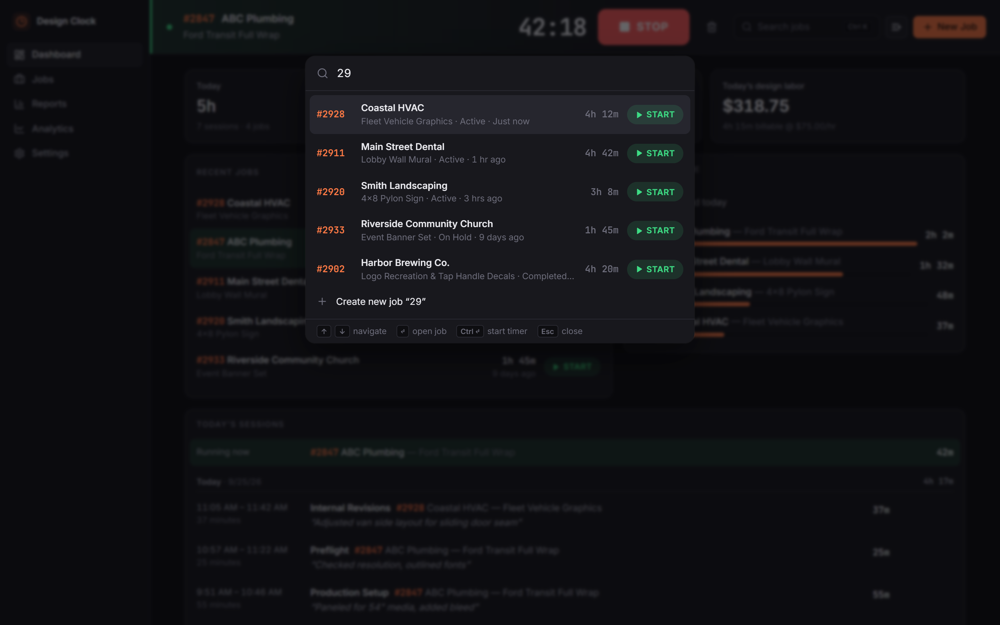<br/>
  <sub><b>Instant search</b>: <code>Ctrl+K</code>, type a job number, go</sub>
</td>
<td align="center">
  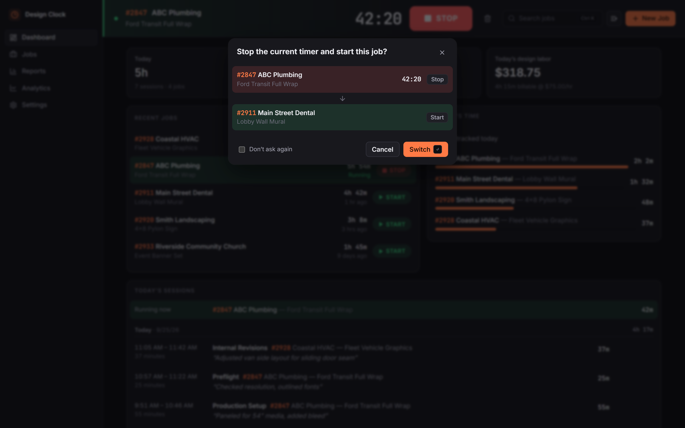<br/>
  <sub><b>Switch jobs</b>: stop the current timer and start the next in one keystroke</sub>
</td>
</tr>
<tr>
<td align="center">
  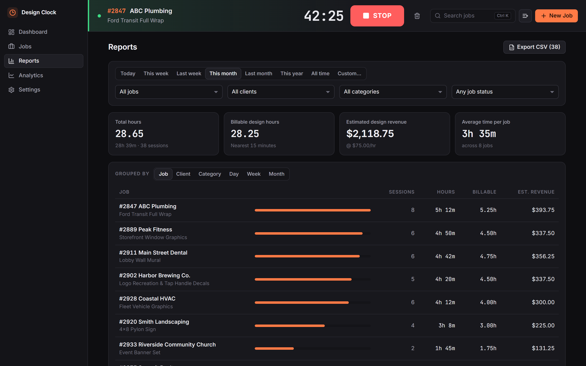<br/>
  <sub><b>Reports</b>: filter, group and export to CSV</sub>
</td>
<td align="center">
  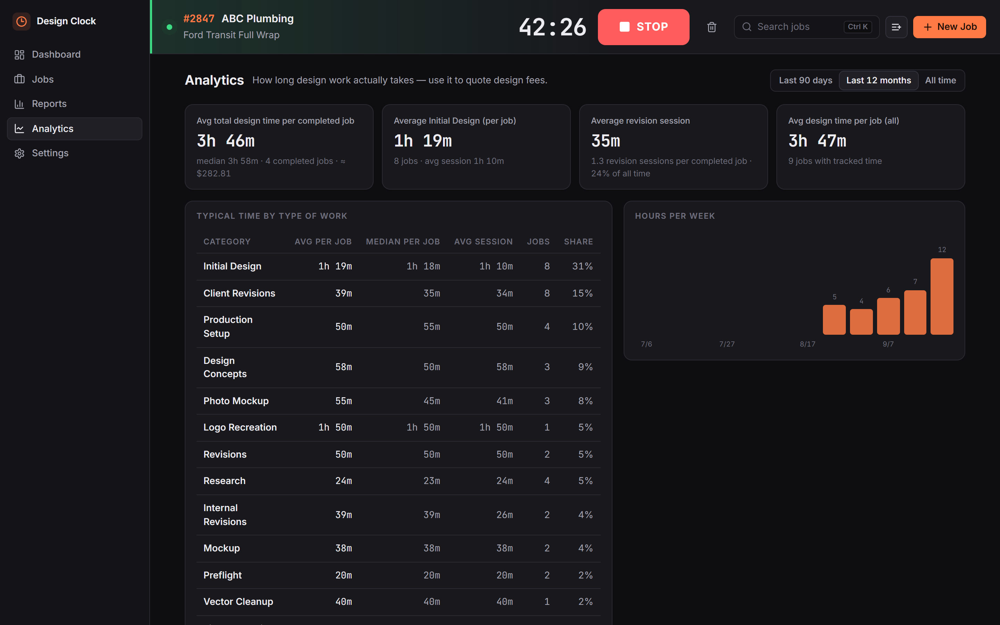<br/>
  <sub><b>Analytics</b>: typical time by type of work, for better quotes</sub>
</td>
</tr>
</table>

<details>
<summary><b>More screenshots</b>: jobs list, new job, manual entry, settings, light theme</summary>
<br/>
<table>
<tr>
<td width="50%" align="center">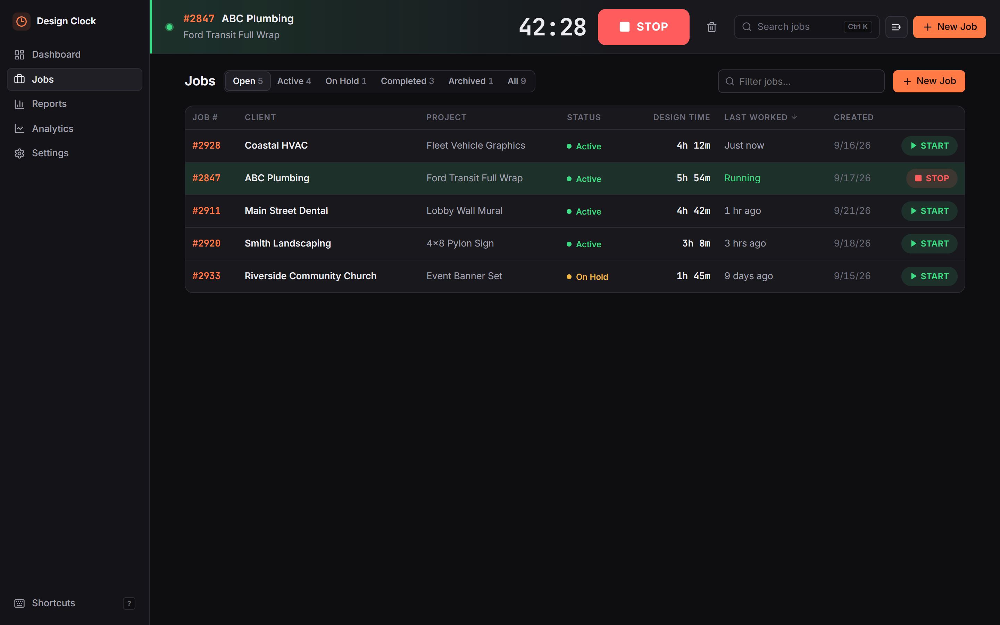<br/><sub><b>Jobs</b>: sortable, filterable, one-click START</sub></td>
<td width="50%" align="center">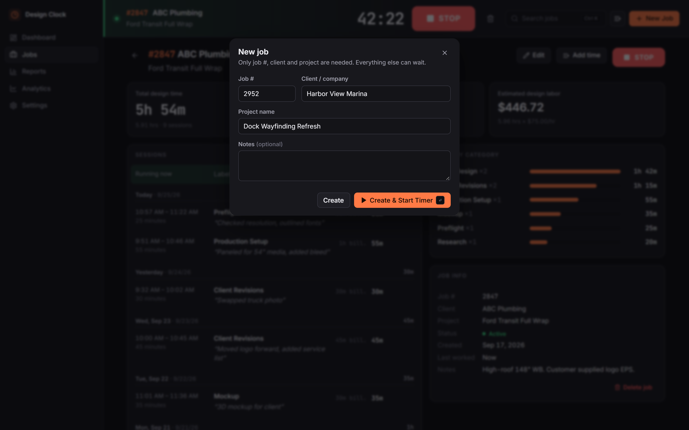<br/><sub><b>New job</b>: three fields, then <i>Create &amp; Start Timer</i></sub></td>
</tr>
<tr>
<td align="center">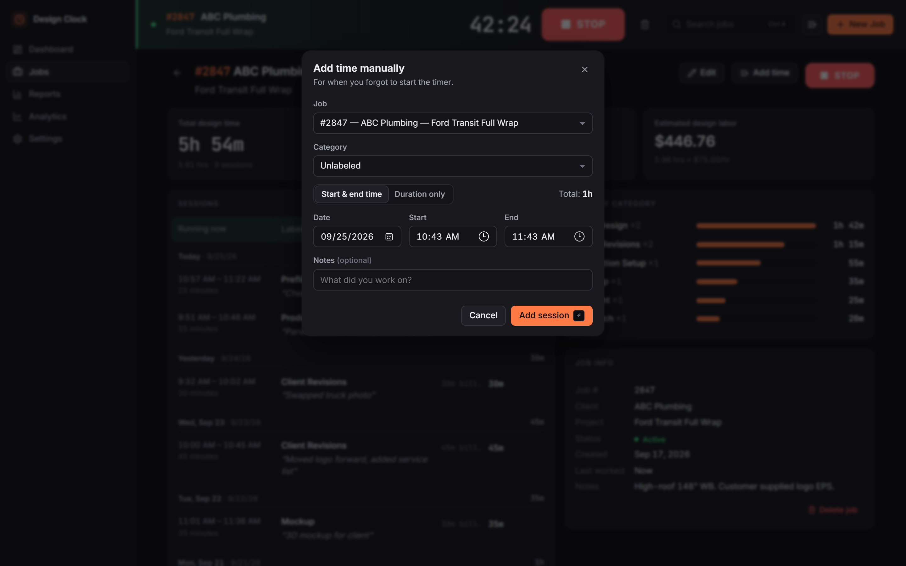<br/><sub><b>Manual entry</b>: start/end times or duration only</sub></td>
<td align="center">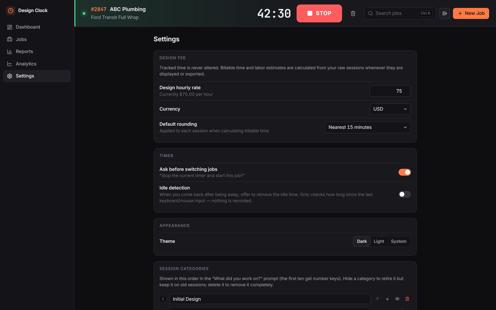<br/><sub><b>Settings</b>: rate, currency, rounding, categories, backups</sub></td>
</tr>
<tr>
<td colspan="2" align="center">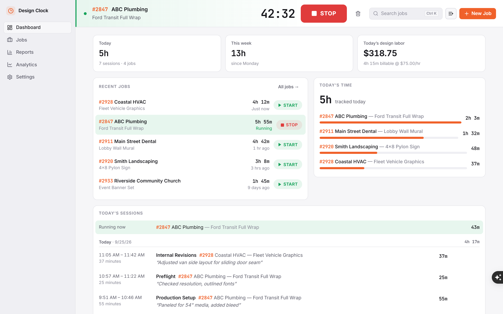<br/><sub><b>Light theme</b></sub></td>
</tr>
</table>
</details>

---

## 🚀 Quick start

> **Requirements:** Windows 10 or 11 and Microsoft Edge (built in). `Setup.cmd` installs Node.js for you if it's missing.

### 1. Download

On this page, click **Code → Download ZIP** and unzip it somewhere permanent, for example `Documents\DesignClock`. Or clone it:

```bash
git clone https://github.com/<your-username>/design-clock.git
```

### 2. Run setup (once per computer)

Double-click **`Setup.cmd`**. It will:

1. Install **Node.js LTS** with `winget` if needed. (Run `Setup.cmd` a second time after this step.)
2. Install dependencies and build the app.
3. Create a **Design Clock** shortcut on your Desktop and in the Start menu.

### 3. Open it

Double-click **Design Clock** on your Desktop. It opens in its own window, with no browser tabs or address bar.

> [!TIP]
> Right-click the Desktop shortcut → **Show more options → Pin to taskbar** to keep it one click away.

<details>
<summary><b>Updating to a newer version</b></summary>
<br/>

Download the ZIP again and unzip it **over** your existing folder (your `data` folder is not in the ZIP, so your time records stay put), or run `git pull`. Then run `Setup.cmd` again.

</details>

<details>
<summary><b>Moving your data to another computer</b></summary>
<br/>

Your time records live in `data\design-clock.db` and are **not** stored on GitHub.

1. On the old computer: **Settings → Data & backup → Download database backup (.db)**.
2. On the new computer: run `Stop Design Clock.cmd`, rename the file to `design-clock.db`, and put it in the app's `data` folder.
3. Open Design Clock.

</details>

---

## 🧭 The daily workflow

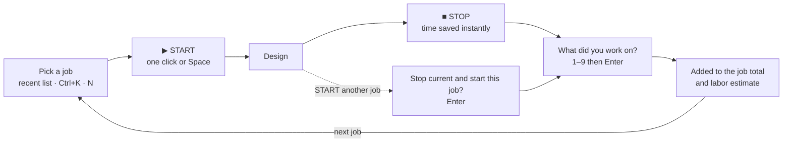

1. **Pick a job.** Click **START** next to it on the Dashboard, or press `Space` to resume the last one.
2. **Design.** The timer at the top shows the job and elapsed time, and the window title shows it in the taskbar.
3. **Stop.** Click **STOP** or press `Space`. The time is saved before anything else happens.
4. **Label it.** The category you last used on that job is preselected, so press `Enter` (or `1–9`, and an optional note).
5. **Repeat.** Forgot the timer? Press `M` to add time manually.

---

## ⌨️ Keyboard shortcuts

| Keys | Action |
|---|---|
| <kbd>Space</kbd> · <kbd>Alt</kbd>+<kbd>S</kbd> | Start / stop the timer (on a job page it starts *that* job) |
| <kbd>Ctrl</kbd>+<kbd>K</kbd> · <kbd>/</kbd> | Search jobs; <kbd>Enter</kbd> opens, <kbd>Ctrl</kbd>+<kbd>Enter</kbd> starts the timer |
| <kbd>Alt</kbd>+<kbd>J</kbd> | Search in *start* mode (<kbd>Enter</kbd> starts the timer) |
| <kbd>N</kbd> · <kbd>Alt</kbd>+<kbd>N</kbd> | New job (<kbd>Enter</kbd> = Create &amp; Start Timer, <kbd>Shift</kbd>+<kbd>Enter</kbd> = create only) |
| <kbd>M</kbd> | Add time manually |
| <kbd>Alt</kbd>+<kbd>1</kbd>…<kbd>5</kbd> | Dashboard · Jobs · Reports · Analytics · Settings |
| <kbd>1</kbd>…<kbd>9</kbd>, <kbd>0</kbd> | Pick a category in the *"What did you work on?"* prompt |
| <kbd>Enter</kbd> · <kbd>Esc</kbd> | Save / confirm · close (in the label prompt: label later) |
| <kbd>?</kbd> | Show all shortcuts |

<sub>Single-letter shortcuts are ignored while you're typing in a field. <kbd>Ctrl</kbd>+<kbd>N</kbd> also works where Edge allows it.</sub>

---

## 💵 How the design-fee math works

```
Tracked design time   = the real, raw time from your sessions (never modified)
Billable design time  = each session rounded by your rounding rule, then added up
Estimated design labor = billable hours × your design rate
```

| Rounding rule | A 22-minute session bills as |
|---|---|
| Exact | 22m |
| Nearest 15 minutes | 15m |
| Nearest 30 minutes | 30m |
| Round up to next 15 minutes | 30m |
| Round up to next 30 minutes | 30m |

The default rule, hourly rate and currency are set in **Settings**. Changing them recalculates everything instantly, because billable values are never stored.

---

## 🔧 How it works

Design Clock is a **local web app dressed as a desktop app**: a small Node.js server bound to `127.0.0.1` stores data in SQLite and serves a React interface. The interface opens in a chromeless Microsoft Edge app window.

```
┌───────────────────────────── your computer ─────────────────────────────┐
│                                                                         │
│   Edge app window                 Node.js server             SQLite     │
│  ┌─────────────────┐   JSON API  ┌──────────────────┐     ┌──────────┐  │
│  │ React 19 + TS   │ ──────────▶ │ server/index.ts  │ ──▶ │ design-  │  │
│  │ (Vite build)    │ ◀────────── │ 127.0.0.1:5178   │ ◀── │ clock.db │  │
│  └─────────────────┘             └──────────────────┘     └──────────┘  │
│                                   optional: idle.ts → Windows            │
│                                   "seconds since last input"             │
└─────────────────────────────────────────────────────────────────────────┘
```

<details>
<summary><b>🛟 How a running timer survives crashes</b></summary>
<br/>

- **START** writes a session row with `start_at = now` and `end_at = NULL` to the database *before* the screen updates.
- The clock you see is always calculated as `now − start_at`. There is no in-memory counter to lose.
- On launch (and whenever the window regains focus) the app loads the open session and carries on. A closed window, crash, reboot or sleep all resume correctly.
- **STOP** writes `end_at` *before* the label prompt opens. If you close the app mid-prompt, the session is kept and shown under **Needs label** on the Dashboard.
- A partial unique index lets the database hold **only one running timer at a time**.

</details>

<details>
<summary><b>🗄️ Database schema</b></summary>
<br/>

| Table | Columns |
|---|---|
| `users` | id, name, created_at. One row today; sessions already reference it for future multi-user support |
| `clients` | id, name (unique, case-insensitive), created_at |
| `jobs` | id, job_number (unique), client_id → clients, project_name, notes, status (`active` / `on_hold` / `completed` / `archived`), created_at, updated_at |
| `categories` | id, name (unique), sort_order, archived |
| `sessions` | id, job_id → jobs, user_id → users, category_id → categories (NULL = needs label), start_at, end_at (NULL = running), idle_sec, notes, source (`timer` / `manual` / `manual_duration`), created_at, updated_at, **duration_sec** *(generated: `(end_at − start_at) / 1000 − idle_sec`)* |
| `settings` | key, value (JSON) |

Migrations are append-only (`PRAGMA user_version`), so future features (quote estimates vs. actual hours, Mothernode or invoice links, project types, cloud sync) can be added without reshaping existing data.

</details>

<details>
<summary><b>🗂️ Project structure</b></summary>
<br/>

```
DesignClock/
├── Setup.cmd                  one-time setup on a new computer
├── Design Clock.vbs           launcher (no console window)
├── Create Desktop Shortcut.ps1
├── Stop Design Clock.cmd      stops the background server
├── assets/                    app icon (.ico / .png)
├── docs/images/               README screenshots (npm run screenshots)
├── server/                    Node 24, runs TypeScript directly, no build step
│   ├── db.ts                  schema + migrations
│   ├── index.ts               JSON API, static files, app-window launcher
│   ├── idle.ts                optional idle detection
│   ├── seed.ts                sample jobs for development
│   └── reset.ts               npm run reset-db
├── src/                       React 19 + TypeScript + Vite
│   ├── api.ts                 typed API client
│   ├── store.tsx              app state, timer actions, hash router
│   ├── lib/                   time, rounding & labor math, CSV export
│   ├── components/            TimerBar, LabelModal, SearchPalette, SessionList…
│   └── pages/                 Dashboard, Jobs, JobDetail, Reports, Analytics, Settings
└── data/design-clock.db       your data (git-ignored)
```

</details>

<details>
<summary><b>🔒 Privacy &amp; idle detection</b></summary>
<br/>

- The server only listens on `127.0.0.1` and can't be reached from your network.
- No telemetry, analytics or outbound network requests. Fonts and icons are bundled.
- Idle detection is **off by default**. When enabled, the server asks Windows for one number every 5 seconds: seconds since the last keyboard or mouse input (`GetLastInputInfo`). Nothing about *what* you typed or clicked is read or stored.

</details>

---

## 📤 Export &amp; backup

| Where | What you get |
|---|---|
| **Reports → Export CSV** | The sessions matching your current filters |
| **Settings → Export all sessions (CSV)** | Every session: Job Number, Client, Project, Job Status, Session Date, Start / End Time, Duration, Category, Notes, Billable Duration, Rounding, Design Rate, Currency, Estimated Design Cost, Entry Type |
| **Settings → Download database backup (.db)** | A consistent snapshot of the whole SQLite database |
| **Settings → Full export (JSON)** | Every table, for use in other tools |

CSV files open directly in Excel (UTF-8 with BOM).

---

## 🛠️ Development

```bash
npm install
```

```bash
npm run dev
```

`npm run dev` runs the API on `:5178` with auto-restart, and Vite with hot reload on http://localhost:5173. A development database is seeded with sample jobs.

| Command | What it does |
|---|---|
| `npm run build` | Type-check the UI and server, then build the interface into `dist/` |
| `npm run app` | Start the server and open the app window |
| `npm run typecheck` | TypeScript check only |
| `npm run screenshots` | Regenerate `docs/images` with headless Edge, using a temporary sample database |
| `npm run reset-db` | Delete the local database |

| Environment variable | Purpose |
|---|---|
| `PORT` | Server port (default `5178`) |
| `DESIGN_CLOCK_DATA` | Use a different data folder |
| `DESIGN_CLOCK_SEED=1` | Seed sample jobs into a brand-new database |

**Tech stack:** React 19 · TypeScript 5 · Vite 6 · Node.js 24 (built-in `node:sqlite`, so there are no native modules to compile) · lucide icons · Inter &amp; JetBrains Mono (bundled).

---

## 🗺️ Roadmap

- [x] One-click timers, label-after-stop, job switching
- [x] Crash-proof timer recovery
- [x] Manual entries, editing, search
- [x] Design-fee calculator with rounding
- [x] Reports, CSV export, analytics, backups
- [x] Optional idle detection
- [ ] Quoted design hours vs. actual hours per job
- [ ] Project-type categories (wraps, monuments, banners…) for quoting benchmarks
- [ ] Mothernode / invoice integration
- [ ] Multiple designers
- [ ] Optional cloud sync between computers
- [ ] Native installer (Tauri)

---

## ❓ FAQ

**Does closing the window stop my timer?**
No. The timer is a timestamp in the database, and the app keeps running in the background. Reopen the window and it's still counting. Use `Stop Design Clock.cmd` to shut the background server down completely.

**Is my time data uploaded to GitHub?**
No. `data/` is in `.gitignore`. GitHub only holds the app's code. Each computer keeps its own database.

**Can two computers share the same data?**
Not live. Move data with a `.db` backup (see *Moving your data* above). Cloud sync is on the roadmap.

**Does it work on macOS or Linux?**
It's built and tested for Windows. The core app should run anywhere Node.js 22.5+ runs (`npm run build`, `npm start`, then open http://127.0.0.1:5178 in a browser), but the launcher, shortcuts, app window and idle detection are Windows-only.

**Why a local web app instead of a native app?**
It needs no Rust or Visual Studio toolchain, installs in one step, and keeps the code simple. The interface only talks to the server through `src/api.ts`, so a native [Tauri](https://tauri.app) build could be added later without rewriting the interface.

---

## 📄 License

Released under the [MIT License](LICENSE).

<br/>

<p align="center">
  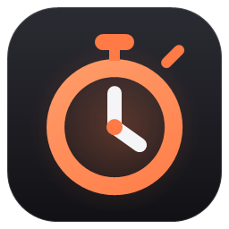<br/>
  <sub><b>Design Clock</b>: track the time, quote with confidence.</sub>
</p>
